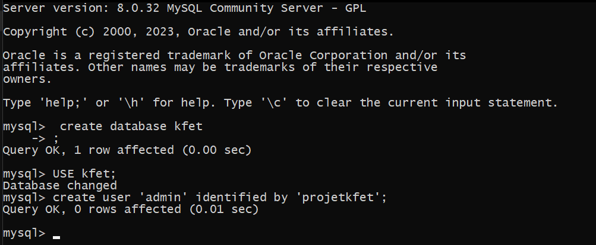

# ProjetKfet
 Projet libre d'étudiant de 5ème année à Polytech Tours

# Description

Ce projet comporte le backend et le frontend d'une application web de gestion de Kfet.

Le dossier *backend* contient le backend de l'application.

Le dossier *frontend* contient le frontend de l'application.

# Installation

## Frontend

### Prérequis
Il convient tout d'abord d'installer NodeJS 

- Rendez-vous sur le site de [NodeJS](https://nodejs.org/en/download/)
- Cliquez sur le logo Windows Installer dans la section LTS pour télécharger l'installer  
  
- Lancez le .msi téléchargé
    - Le chemin d'installation n'est pas très important
    - Vérifiez que le symbole à côté de "*Add to PATH*" est bien le même que pour les autres champs
    - Il n'y a pas besoin d'installer les outils nécessaires et Chocolatey
- Ouvrez un terminal en tapant `cmd` dans la barre de recherche du pc et tapez la commande `node -v` pour vérifier
  que l'installation s'est bien déroulée. Il devrait alors apparaître la version de node téléchargée :  
    

> Si le terminal affiche "command not found", essayez de fermer le terminal et de recommencer sur un nouveau.

### Installation des dépendances
Ouvrez un terminal dans le dossier *frontend* et tapez la commande `npm install` pour installer les dépendances nécessaires au projet.

## Backend

### Prérequis

Pour utiliser le backend, il faut d'abord créer une base de donnée. 

Pour cela, il faut installer MySQL ou autre et créer une base de donnée.

La base de donnée doit s'appeler `kfet`

il faut ensuite créer un utilisateur pour la base de donnée. Le nom doit être `admin` et le mot de passe `projetkfet`.

```sql
CREATE DATABASE kfet;

USE kfet;

CREATE USER 'admin'@'localhost' IDENTIFIED BY 'projetkfet';
```

Si on souhaite changer des paramètres de la base de donnée, il faut modifier le fichier `src/main/resources/application.properties`

Exemple d'exécution : 


### Projet

Le backend est un projet Spring Boot. Il est conseillé d'utiliser IntelliJ IDEA pour l'ouvrir. La configuration de lancement se fait automatiquement.

Ouvrir le fichier pom.xml pour être sûr que les dépendances Maven sont bien installées.

### Postman

Il est conseillé d'utiliser Postman pour tester les requêtes HTTP.

# Utilisation

## Backend

### Gestion base de données

Dans le fichier `application.properties`, il est possible de modifier les paramètres de la base de donnée.

Le paramètre `spring.jpa.hibernate.ddl-auto` permet de choisir le mode de création de la base de donnée. 
Les paramètres les plus utiles sont :
- `create-drop` : Créer la base de donnée à chaque lancement de l'application et la supprime à la fin
- `update` : Met à jour la base de donnée à chaque lancement de l'application

## Frontend
Ouvrez un terminal dans le dossier *frontend* et tapez la commande `npm run serve` pour lancer le serveur de développement.


# A faire / Améliorations

## Backend

### Séparation du code

Il est possible de rajouter un package `service` pour séparer les classes de la couche service de la couche controller.

### Images

Pour le champ image, si on souhaite les stocker en Base64, il faut rajouter la propriété aux champs images :

```java
@Column(columnDefinition = "text")
```

D'autres techniques peuvent être utilisées pour stocker les images.

### Tests

Il faut ajouter des tests unitaires et d'intégration.

### Sécurité

Seul les utilisateurs connecté ont le droit d'utiliser l'application. Il serait interresant de mettre en place un système de token
lorsqu'un utilisateur se connecte et qu'il soit requis pour toutes les requêtes.

# Auteurs
2023 : 
* **[Thibault Azemar](https://github.com/Thibault-Azemar)** - *Initial work* - Backend
* **[Thomas Blumstein](https://github.com/Oute-Oute)** - *Initial work* - Frontend
* **[Aurélie Thuriot](https://github.com/Nattraser)** - *Initial work* - Frontend


